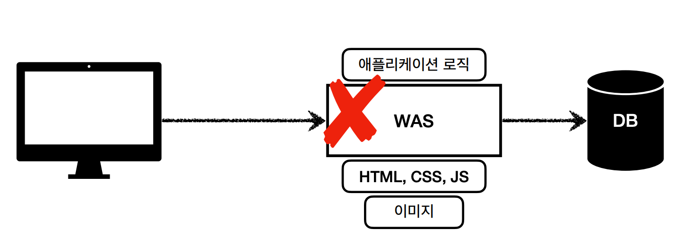
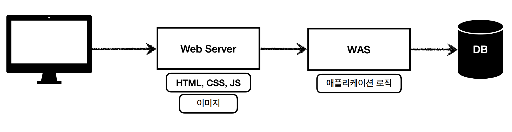
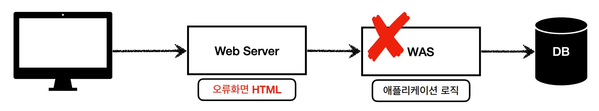
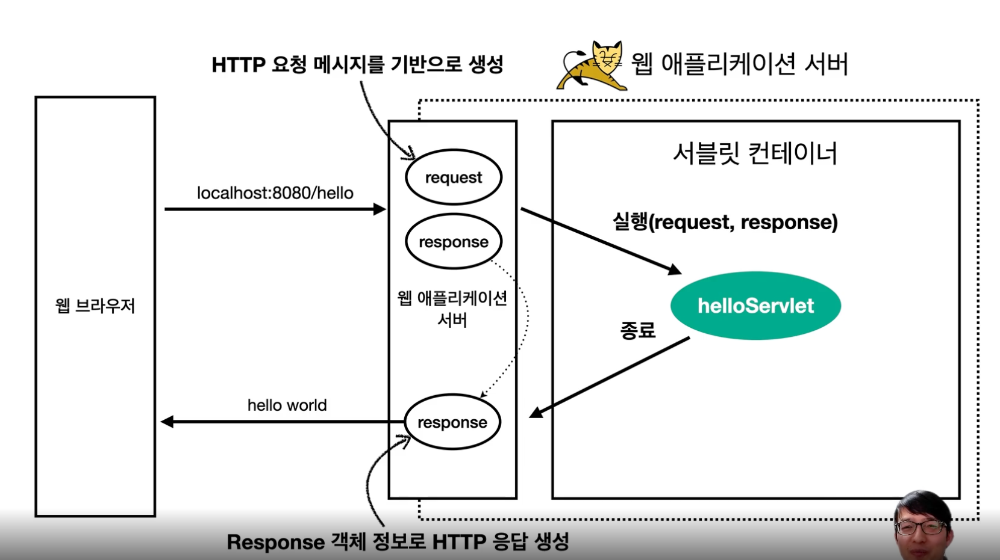
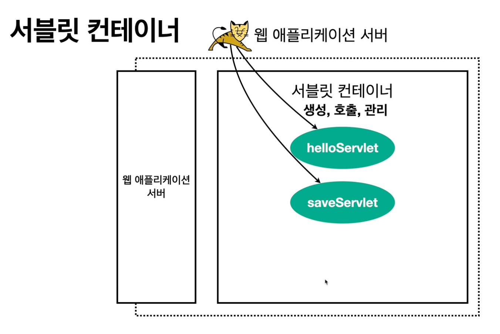

# 웹 애플리케이션 이해
- 웹 브라우저 (클라이언트) 에서 URL을 치면 인터넷을 통해서 서버로 접근하고, 서버에서는 html을 만들어서 클라이언트에 내려준다. 그러면 웹 브라우저가 받은 html을 유저에게 보여준다.
- 클라이언트에서 서버로 데이터를 전송할때, 서버에서 클라이언트에서 데이터를 응답할때 이때 HTTP라는 프로토콜을 기반으로 동작한다
- 서버간에 데이터를 주고 받을 때도 대부분 HTTP 사용

## 웹 서버, 웹 애플리케이션 서버

### 웹 서버(Web Server)
- HTTP 기반으로 동작
- 정적 리소스 제공, 기타 부가기능
- 정적(파일) HTML, CSS, JS, 이미지, 영상
  - html을 특정 사용자마다 다르게 보여주거나 할 수 없다.
- 얘) NGINX, APACHE

### 웹 애플리케이션 서버 (WAS = Web Application Server)
- HTTP 기반으로 동작
- 웹 서버 기능 포함+ (정적 리소스 제공 가능)
- 프로그램 코드를 실행해서 **애플리케이션 로직** 수행
  - 동적 HTML, HTTP API(JSON) 
    - 사용자에 따라서 다르게 보여줄 수 있다. ex) 유저 이름
  - 서블릿, JSP, 스프링 MVC
- 예) 톰캣(Tomcat) Jetty, Undertow

### 웹 서버, 웹 애프리케이션 서버(WAS) 차이
참고용 사이트 : https://gmlwjd9405.github.io/2018/10/27/webserver-vs-was.html
- 웹 서버는 정적 리소스(파일), WAS는 애플리케이션 로직
- 사실 둘 의 용어도 경계가 모호함
  - 웹 서버도 프로그램을 실행하는 기능을 포함하기도 함
  - 웹 애플리케이션 서버도 웹 서버의 기능을 제공함
- 자바는 서블릿 컨테이너 기능을 제공하면 WAS
  - 서블릿 없이 자바코드를 실행하는 서버 프레임워크도 있음
- **WAS는 애플리케이션 코드를 실행하는데 더 특화**

### 웹 시스템 구성 - WAS, DB
- WAS, DB만으로 시스템 구성 가능
- WAS는 정적 리소스, 애플리케이션 로직 모두 제공 가능 
- 문제점
  - WAS가 너무 많은 역할을 담당, 서버 과부하 우려
  - 가장 비싼 **애플리케이션 로직**이 정적 리소스 때문에 수행이 어려울 수 있음
  - WAS 장애시 오류 화면도 노출 불가능
  

  

- ### 웹 시스템 구성 - WEB, WAS, DB
- 정적 리로스는 웹 서버가 처리
- 웹 서버는 애플리케이션 로직같은 동적인 필요가 필요하면 WAS에 요청을 위임
- WAS는 중요한 애플리케이션 로직 처리 전담
- 효율적인 리소스 관리
  - 정적 리소스가 많이 사용되면 Web 서버 증설
  - 애플리케이션 리소스가 많이 사용되면 WAS 증설
- 정적 리소스만 제공하는 **웹 서버는 잘 죽지 않음**
- 애플리케이션 로직이 동작하는 **WAS 서버는 잘 죽음**
- WAS, DB 장애시 WEB 서버가 오류 화면 제공 가능
  - 요즘에는 CDN이라고 정적 리소스를 캐시할 수 있는 중간 서버를 놓는다
  - 데이터로 API만 제공하면 굳이 web server 필요 없다. was 서버만 구축해도 된다

## 서블릿

서블릿을 지원하는 WAS을 사용하면 의미있는 비즈니스 로직을 제외한 모든 일을 대신해줌 ( 위 아래 )

> 서버에서 처리해야하는 업무 ( 웹 애플리케이션 서버 직접 구현할 때 과정 )
>
> - 서버 TCP/IP 연결 대기, 소켓 연결
> - 서버 TCP/IP 연결 대기, 소켓 연결
> - HTTP 요청 메시지를 파싱해서 읽기
> - POST 방식, /save URL 인지
> - Content-Type 확인
> - HTTP 메시지 바디 내용 파싱
>   - username, age 데이터를 사용할 수 있게 파싱
> - 저장 프로세스 실행
> --------------
> - 비즈니스 로직 실행
>   - 데이터베이스에 저장 요청
> --------------
> - HTTP 응답 메시지 생성 시작
>   - HTTP 시작 라인 생성
>   - Header 생성
>   - 메시지 바디에 HTML todtjddptj dlqfur
> - 서버 TCP/IP 응답 전달, 소켓 종료

> - 특징
>   - HTTP 요청 정보를 편리하게 사용할 수 있는 HttpServletRequest
>   - HTTP 응답 정보를 편리하게 제공할 수 있는 HttpServletResponse
>   - 개발자는 HTTP 스펙을 매우 편리하게 사용

### HTTP 요청 시
- WAS는 Request, Response 객체(요청마다 새로 생성)를 새로 만들어서 서블릿 객체(싱글톤) 호출
- 개발자는 Request 객체에서 HTTP 요청 정보를 편리하게 꺼내서 사용
- 개발자는 Response 객체에 HTTP 응답 정보를 편리하게 입력
- WAS는 Response 객체에 담겨있는 내용으로 HTTP 응답 정보를 생성

### 서블릿 컨테이너

- 톰캣처럼 서블릿을 지원하는 WAS를 서블릿 컨테이너라고 함
- 서블릿 컨테이너는 서블릿 객체를 생성, 초기화, 호출, 종료하는 생명주기 관리
- 서블릿 객체는 **싱글톤으로 관리**
  - 고객의 요청이 올 때 마다 계속 객체를 생성하는 것은 비효율
  - 최초 로딩 시점에 서블릿 객체를 미리 만들어두고 재활용
  - 모든 고객 요청은 동일한 서블릿 객체 인스턴스에 접근
  - **공유 변수 사용 주의**
  - 서블릿 컨테이너 종료시 함께 종료
- JSP도 서블릿으로 변환 되어서 사용
- 동시 요청을 위한 멀티 쓰레드 처리 지원